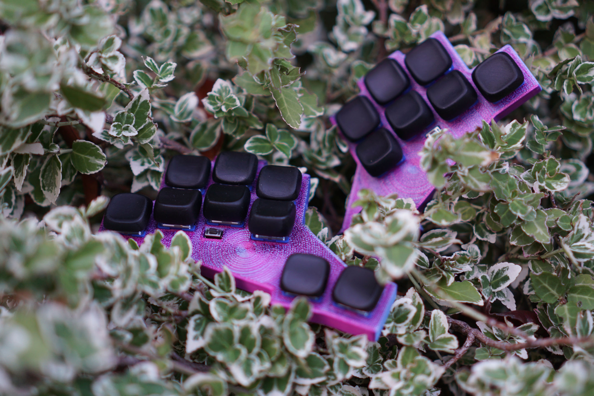
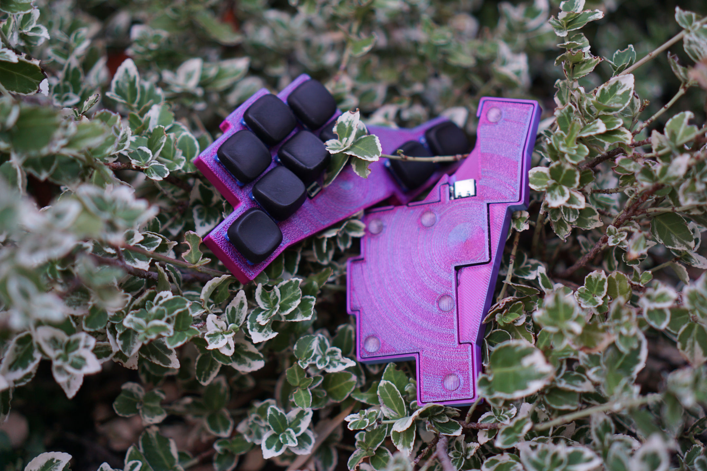

# TwoNr9 (2NR9) is a minimalistic ergonomic 20% Keyboard. 

[Pictures by Purox/Nex](https://ncxy.de/)

## IMPORTANT 
The BOTTOM MIDDLE FINGER AND THE PINKY NEED A BODGE WIRE DUE TO WRONGLY FLIPPED HOTSWAP SOCKETS.  

## Features: 
- 18 Keys with an Minimalistic  Design and Case
- The Case offers hidden Magnet sockets for Magsafe Compability
- Switches: Choc V2 Hotswap 
- MCU: N!N (or Clones)
- battery: 301230 3.7V 110mAh Lipo Battery
  - only this one works
- Designed Together with [Purox/Nex](https://ncxy.de/)

### Files In this Repo 
- The PROD files as ZIP as well as a folder, the Kicad PCB File 
- CASE (To-Do)

## ZMK Config: 
- There is a [Blanc Version of the Config](https://github.com/theharmy/zmk-config-twonr9--blank)
- My personal [Config](https://github.com/theharmy/zmk-config), (AI CODE WARNING)
	- with [SRHT by Apfel](https://codeberg.org/apfel)  (A Germlish 2Alpha Layout with Bigrams)
	- and many features of [Urob's ZMK Config](https://github.com/urob/zmk-config) 

### Acknowledgements
- Big Thanks and Much love to 
	- [Purox/Nex](https://ncxy.de/) for a lot of test-printing with me, PCB Design-Support and Feedback.
		- Their: 
			- [Blog](https://ncxy.de/) 
			- [Keyboard Work](https://git.clacktal.es/purox)
			- [Github](https://github.com/ThePurox)
	- Kilipan/Apfel for Getting me Into the 20% Madness, Creation of the SRHT Layout, Patience and Input
		- their:
			- [Codeberg](https://codeberg.org/apfel), for general projects
			- [clacktal.es](https://git.clacktal.es/apfel), for keyboard-related things
